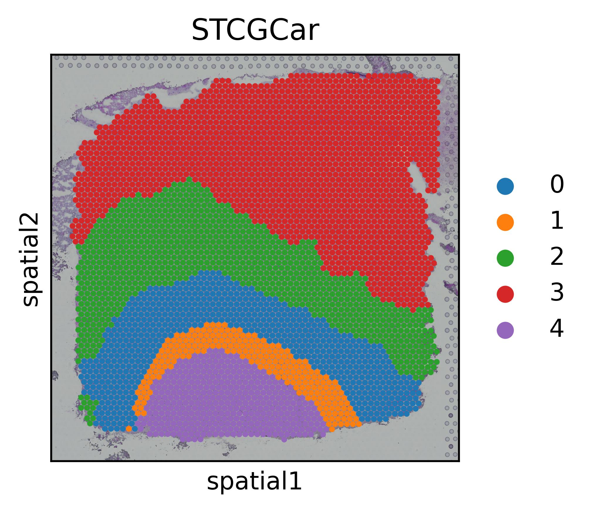
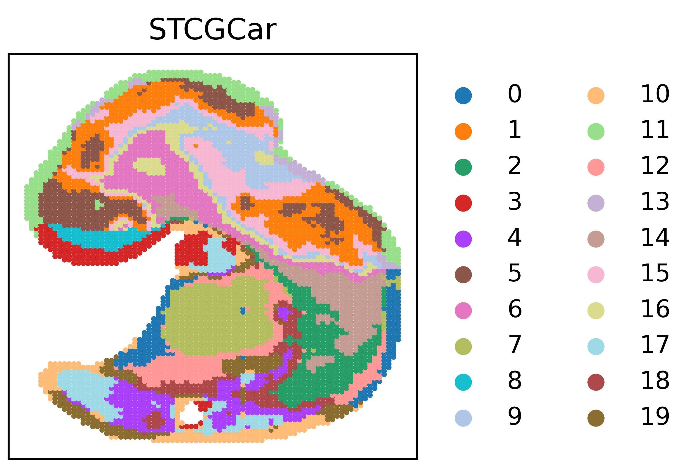
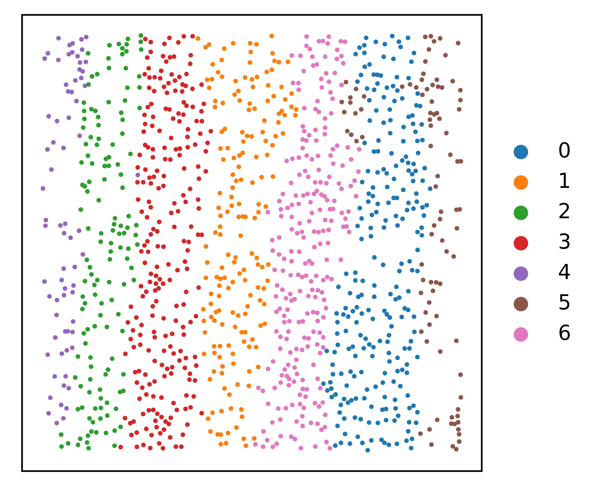

# STCGCar: Spatial Transcriptomics Clustering with Graph Contrastive Learning and Augmentation Strategy

STCGCar is a state-of-the-art framework designed for clustering spatial transcriptomics (ST) data. By leveraging graph contrastive learning, reversible networks for data augmentation, and redundancy reduction strategies, STCGCar effectively overcomes challenges in high-dimensional data clustering and achieves superior performance.

---

## Framework Overview


The STCGCar framework consists of the following components:
1. **Graph Contrastive Learning**: Extracts robust embeddings from ST data while ensuring consistency across augmented views.
2. **Reversible Neural Networks for Data Augmentation**: Generates diverse, high-quality augmented views to improve model generalizability.
3. **Redundancy Reduction Strategy**: Mitigates feature redundancy in high-dimensional latent spaces to enhance clustering precision.

---

## System Requirements

To ensure smooth execution, the following dependencies are required:

```bash
python == 3.7
torch>=1.12.0
numpy>=1.23.3
scikit-learn>=1.0.2
pandas>=1.4.2
scanpy>=1.8.0
scipy>=1.8.0
matplotlib >= 3.5.1
```

**Hardware**:
- **Recommended GPU**: NVIDIA GTX 2080Ti or above.

---

## Parameter Settings

Below is a detailed description of the key parameters used in the STCGCar framework:

### **1. gnnlayers**
- **Description**: Number of graph convolutional layers embedding the adjacency matrix with the identity matrix.
- **Recommended Value**: 3 to 5 layers.
- **Details**: A balance between computational complexity and model expressiveness. Too many layers may cause overfitting, while too few may fail to capture the complexity of the data.

### **2. rad_cutoff**
- **Description**: Determines the neighbor network range and the number of neighbors per cell.
- **Recommended Value**: Between 6 and 15 neighbors.
- **Details**: For 10x datasets, each cell typically contains 6 neighbors. A rad_cutoff of 150 or 300 is often suitable for 10x datasets to ensure valid neighbor relationships. For other datasets, adjust rad_cutoff dynamically based on data density and structure.

### **3. alpha1 and alpha2**
- **Description**: alpha 1 is coefficient used to balance semantic loss and alpha2 is coefficient used to balance redundancy loss. 
- **Recommended Value**: We set alpha 1 and alpha 2 to 0.5 and 0.8 in all datasets, respectively. 
- **Details**: Ensures stability and consistency during training.

### **4. lr (Learning Rate)**
- **Description**: Dynamically adjusted learning rate based on the loss function.
- **Default Value**: `1e-3` for all datasets during the initial phase.
- **Details**:
  - For **unlabeled datasets**: Use `1e-3`.
  - For **labeled datasets**: Use a smaller learning rate, e.g., `1e-5`, for better results.
  - Learning rate decay mechanism: Reduce the learning rate to `0.75x` every 100 epochs for better model refinement in later training stages.
  - Final range: Adjust dynamically between `1e-3` and `5e-6` based on the loss function.

---

## How to Use

### **1. Clone the Repository**
```bash
git clone https://github.com/plhhnu/STCGCar.git
cd STCGCar
```

### **2. Install Dependencies**
Install all required Python libraries:
```bash
pip install -r requirements.txt
```

### **3. Prepare Data**
- Format spatial transcriptomics data as an AnnData object.
- Ensure the dataset includes spatial coordinates and gene expression matrices.


### **4. start**
- Run DLPFC-main.py to perform clustering experiments on the dataset DLPFC.
- Run v1-main.py to perform clustering experiments on the dataset Human Breast Cancer (Block A Section 1).
- Run BrainFFPE-main.py to perform clustering experiments on the dataset Adult Mouse Brain (FFPE).
- For other labeled as well as unlabeled datasets the experiments can be performed according to v1-main and BeainFFPE-main, respectively.
- python DLPFC-main.py        # dataset DLPFC
- python v1-main.py           # dataset Human Breast Cancer (Block A Section 1)
- python BrainFFPE-main.py    # dataset Adult Mouse Brain (FFPE)


### **5. Evaluate and Visualize Results**
- **Cluster Assignments**: Predicted spatial domains for each spot.
- **Performance Metrics**: ARI,NMI, and other clustering metrics.

---

## File Structure

```plaintext
STCGCar/
├── BrainFFPE-main.py      # Main script for training and evaluation on Adult Mouse Brain (FFPE).
├── DLPFC-main.py          # Main script for training and evaluation on DLPFFC.
├── v1-main.py             # Main script for training and evaluation on Human Breast Cancer (Block A Section 1).
├── models/                # Model architectures
├── data/                  # Example datasets
├── utils/                 # Utility functions
├── outputs/               # Directory for saving results
└── README.md              # Documentation
```

---

## Results and Visualizations

STCGCar has been tested on multiple public spatial transcriptomics datasets, achieving state-of-the-art performance. Below is an example visualization of spatial clustering:
STCGCar clustering results on eight datasets:

<table>
  <tr>
    <td></td>
    <td></td>
    <td></td>
    <td></td>
  </tr>
  <tr>
    <td></td>
    <td></td>
    <td></td>
    <td></td>
  </tr>
</table>


---

## Citation

If you use STCGCar in your research, please cite:

```bibtex

```

---
